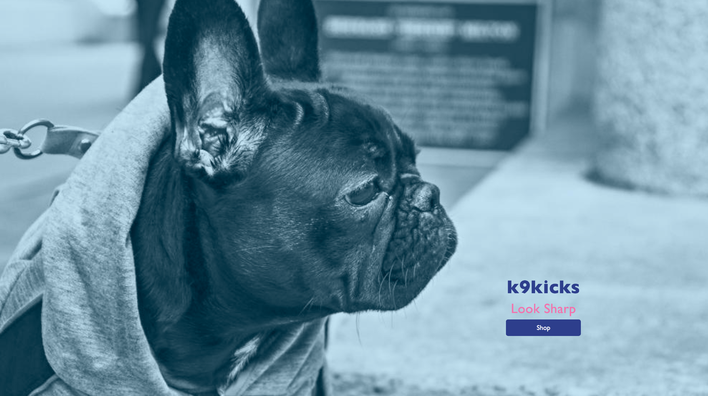

# k9kicks
The premier site for puppy paw fashion!

# setup
To run k9kicks locally, fork and/or clone this repo and run `npm install`. You will need to run both the Express server (back-end) and React server (fron-tend). Express can be started with `npm run start` and React can be started with `npm run react`.  

Go fetch some great stuff!

# the team and the purpose
k9kicks was created by Betty Chempananical, Erica Rottman, and Amber Murray. The aim of this project: to answer the age-old question:  What happens when your pooch pal's paws are barking?  How do you keep your dog looking great and feeling amazing at the dog park?  K9Kicks is the answer! This super user friendly e-commerce site makes outfitting your furry friend in the latest fashion trends a walk in the dog park!

# tech-stack
API: Postgres, Knex  
Back-end Server: Express / Node.js  
Overall: ES6, JSX (yep - we did that!)  
Front-End: React, React-Bootstrap, HTML5, CSS3, and our good friend JavaScript  
Deployment to the Interwebs: Heroku
